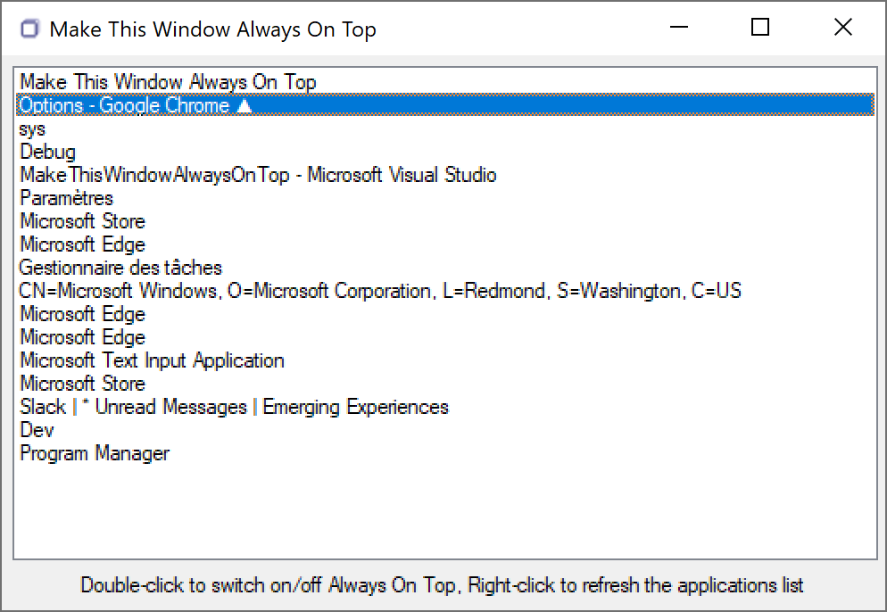

# MakeThisWindowAlwaysOnTop
Small Windows tool that can make any window shown as Always On Top

- Double-click on MakeThisWindowAlwaysOnTop.exe
- A pretty list of all running apps appears
- Double-click on any app to display it as an Always-On-Top (a black arrow ▲ should appear next to its name)
- Double-click again to reverse as a non Always-On-Top
- Right-click on the list to refresh it in case the application you are looking for is not yet there

